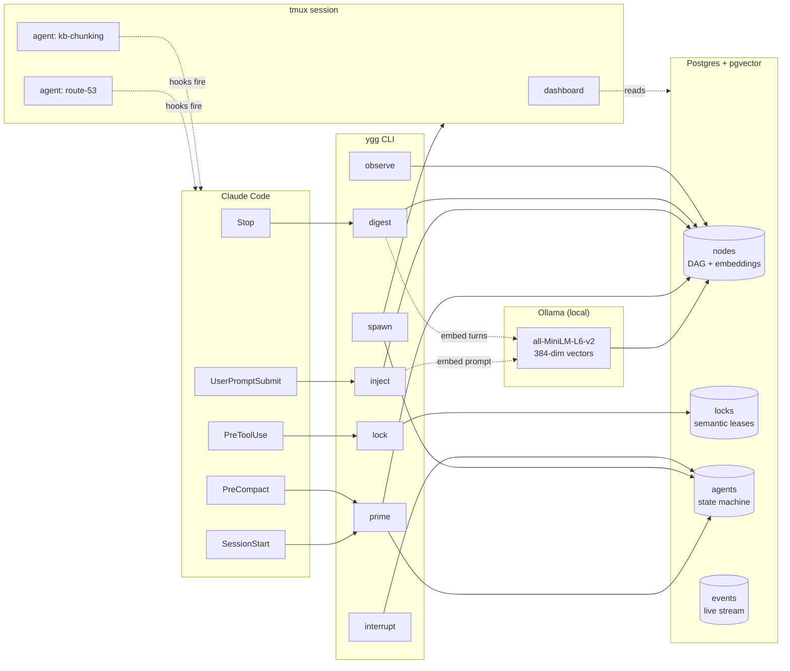

# Yggdrasil

**High-density multi-agent orchestration for Claude Code and sibling CLI agents.**

Yggdrasil is the coordination layer that lets multiple autonomous coding agents share a workspace without stepping on each other. It provides resource leases, a similarity-indexed conversation DAG, cross-session memory, and live-event introspection — all wired into Claude Code via hooks. The CLI binary is `ygg`.

---

## Why Yggdrasil exists

Running one agent in a terminal is easy. Running three to seven is *taxing but common* — many developers already do it, juggling tmux panes and mental state. Beyond that, things get tricky fast: too many windows to watch, too much overlap on shared files, too much context lost to compaction, too much prior conversation that never comes back even when it's relevant.

I've used [beads](https://github.com/steveyegge/beads) and [gastown](https://github.com/steveyegge/gastown) and learned a lot from both.[^1] And then, as is apparently the rite of passage in this space, I went ahead and built my own orchestration agent anyway. Yggdrasil is that project. It focuses on the parts I kept wanting and didn't already have in one place:

- a shared **lock graph** so agents don't clobber each other mid-edit,
- a **memory layer** that surfaces prior-conversation context by similarity — across sessions *and across repositories*,
- **context-pressure telemetry** that fires a digest before compaction,
- **live event streams** for humans watching multiple agents at once.

One deliberate divergence from most of the tooling in this space: Yggdrasil is **global per user**, not per repo. One Postgres instance backs every repo you work in; agents are auto-keyed by the basename of the current working directory. Foundational knowledge — conventions, gotchas, workarounds — is shared, not isolated. The trade-off is pollution risk from cross-repo hits, which is the central open question this project is exploring. See [ADR 0008](docs/adr/0008-shared-db-across-repos.md) and [Open questions](docs/open-questions.md).

## Architecture at a glance



### The pieces

- **Nodes** form a DAG: every user message, assistant message, tool call/result, digest, and directive is a row. Parent/child edges preserve turn structure; an `ancestors` array materializes the path for cheap subtree queries.
- **Semantic embeddings** are what make the DAG *useful* across sessions. Every node's content is embedded on write via a local Ollama model (`all-minilm` / all-MiniLM-L6-v2, 384 dimensions), stored in a `pgvector` column, and indexed with HNSW for cosine-similarity search. Deeper rationale in [docs/retrieval.md](docs/retrieval.md).
- **Locks** are short-TTL leases on arbitrary string keys (file paths, branch names, topics) with heartbeats. Advisory; coordinate cooperating agents. See [ADR 0003](docs/adr/0003-lock-graph-coordination.md).
- **Agents** are a state machine: `idle → planning → executing → waiting_tool → context_flush → …`.
- **Events** stream out of Postgres via `LISTEN`/`NOTIFY` for `ygg logs --follow` and the TUI dashboard.
- **Hooks** live in `~/.claude/ygg-hooks/` and shell out to `ygg` subcommands at Claude Code lifecycle events. See [ADR 0005](docs/adr/0005-shell-hook-integration.md).
- **tmux** is the display substrate — `ygg spawn` opens a new window in the Yggdrasil tmux session so spawned agents are visible and attachable. See [ADR 0007](docs/adr/0007-tmux-as-substrate.md).

Yggdrasil runs as a set of subcommands under the `ygg` binary; there is no long-running daemon other than the optional `ygg watcher`.

## Getting started

```bash
docker-compose up -d           # Postgres 16 + pgvector, Ollama
make install                   # cargo build --release && copy to ~/.local/bin
ygg init                       # install hooks, pull embedding model, run migrations
ygg up                         # open the tmux dashboard
```

From inside Claude Code:

```bash
ygg status                     # see every agent + outstanding locks
ygg lock acquire src/db.rs     # before you edit a shared file
ygg spawn --task "..."         # open a parallel agent in a new window
ygg logs --follow              # live event stream (every hook fire, embedding call, digest)
```

## Subcommand reference

| Command     | Purpose                                                                 |
|-------------|-------------------------------------------------------------------------|
| `up`        | Launch the tmux dashboard (default when run bare).                     |
| `init`      | Bootstrap: Postgres check, Ollama model pull, migrations, hooks.       |
| `migrate`   | Run database migrations.                                                |
| `run`       | Start an agent run loop.                                                |
| `spawn`     | Spawn a new agent in a tmux window, registered in the DB.               |
| `observe`   | Ingest an existing Claude Code session transcript.                      |
| `inject`    | Called by `UserPromptSubmit` — writes prompt node, emits similar-context directives. |
| `prime`     | Called by `SessionStart`/`PreCompact` — emits agent context as markdown. |
| `digest`    | Called by `Stop` — extracts corrections/sentiment into a Digest node.  |
| `lock`      | Acquire / release / list / heartbeat resource locks.                    |
| `interrupt` | Human overrides: take-over, pause, resume.                              |
| `status`    | Quick text output of agent + system state.                              |
| `logs`      | Live event stream (stdout).                                             |
| `dashboard` | Launch the TUI dashboard directly.                                      |
| `watcher`   | Background daemon — heartbeats, lock expiry, digest triggers.           |
| `recover`   | Recover orphaned agents stuck in active states.                         |

## Project layout

```
src/
├── cli/          one file per subcommand
├── models/       agent, node, event — sqlx types + repos
├── analytics/    similarity, pressure, salience aggregates
├── stats/        token accounting, telemetry
├── tui/          dashboard views (ratatui)
├── config.rs     env loading
├── db.rs         sqlx pool + migrations runner
├── embed.rs      Ollama HTTP client
├── executor.rs   agent run loop
├── interrupt.rs  human-override primitives
├── lock.rs       LockManager — acquire/release/heartbeat
├── ollama.rs     embedding model interface
├── pressure.rs   context-pressure estimation
├── salience.rs   memory ranking
├── status.rs     status aggregation
├── tmux.rs       tmux window management
└── watcher.rs    background daemon
migrations/       Postgres schema
docs/             Prose docs (see Further reading below)
docs/adr/         Architecture Decision Records
```

## Further reading

Deeper topics live in `docs/`:

- [**Retrieval and injection**](docs/retrieval.md) — why embeddings (and why not *only* embeddings), what gets injected at `UserPromptSubmit` and `PreToolUse`, sequence diagrams for each flow, and the classifier-gated tool-level injection we haven't shipped yet.
- [**Design principles**](docs/design-principles.md) — substrate separation; premises, not rules; smarter-cheaper-fewer-tokens with a concrete cache taxonomy; habituation / disclosure gate; epoch reflections; the forgetting question.
- [**Open questions**](docs/open-questions.md) — the central hypothesis (does shared memory across agents help or hurt?), directions under consideration, and the named LLM failure modes Yggdrasil touches (context rot, see-sawing, sycophancy, cross-agent contamination).
- [**References**](docs/references.md) — tooling we compose with and research we build on.
- [**`docs/adr/`**](docs/adr/) — Architecture Decision Records for every non-obvious design choice.

---

[^1]: Project URLs are best-effort; the canonical beads repository per `.beads/README.md` is `github.com/steveyegge/beads`. Earlier drafts of this README pointed elsewhere; corrected here.

## License

MIT.
