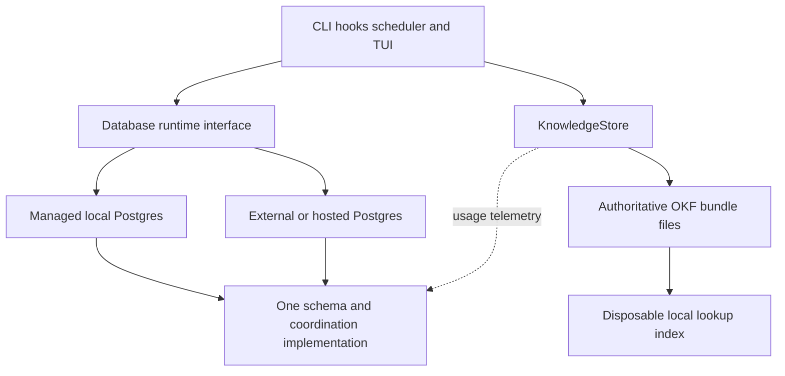

# Managed Postgres and Open Knowledge Format implementation plan

Status: proposed implementation plan. Date: 2026-10-08. Tracking: yggdrasil-3.

Make local Yggdrasil usable without installing or administering Postgres, retain
hosted Postgres, and replace the database-backed durable knowledge store with
Open Knowledge Format (OKF) documents. Keep PostgreSQL as the coordination engine
in both deployment modes. Make OKF the authoritative representation of notes and
learnings, including their scope and lifecycle; an export command alone does not
complete this change.

This plan covers architecture, migration, implementation order, and release gates.
Commands, configuration, and modules described as new below are proposed surfaces.

## Decisions and scope

1. **Managed local Postgres is the default for new installations.** Yggdrasil
   installs a pinned native Postgres distribution and owns its lifecycle. Here,
   embedded means application-managed: Postgres still runs as a separate process.
   The candidate Rust integration is
   [postgresql_embedded](https://github.com/theseus-rs/postgresql-embedded), which
   supports packaged or downloaded binaries. Validate its lifecycle and packaging
   behavior before selecting a crate version.
2. **External Postgres remains supported.** This includes an existing local server,
   a self-hosted remote server, and a managed database provider. Use the same
   migrations, SQLx models, locking, and task-claim logic in both modes.
3. **OKF replaces durable knowledge storage.** Notes and learnings move to files;
   Postgres retains operational state and optional usage telemetry. Knowledge
   content must remain readable and writable without a database connection.
4. **Preserve deterministic retrieval and approval.** Keep repo/global scope,
   file and rule matching, and the proposed-learning approval gate from
   [ADR 0017](../adr/0017-learning-capture-and-approval.md). Continue the
   [ADR 0015](../adr/0015-retrieval-scope-reduction.md) decision against embeddings
   and automatically generated retrieval corpora.

No SQLite or Dolt backend, generic SQL dialect abstraction, Google Cloud service,
vector search, or automatic knowledge generation is part of this change. Hosting
the database does not introduce a multi-tenant SaaS service or distributed agent
execution. Session handoffs remain operational resume state; they can reference
knowledge documents without becoming the durable knowledge corpus.

## Current implementation and boundaries

The reviewed baseline is commit `0203e7a`.

| Current path | Change required |
| --- | --- |
| [src/config.rs](../../src/config.rs), [src/db.rs](../../src/db.rs) | Replace the mandatory URL with a resolved database target; retain `PgPool` and SQLx migrations. |
| [src/main.rs](../../src/main.rs), [src/cli/init.rs](../../src/cli/init.rs) | Centralize connection setup; replace local package-manager provisioning with managed initialization. |
| [src/lock.rs](../../src/lock.rs), [src/scheduler.rs](../../src/scheduler.rs), [src/watcher.rs](../../src/watcher.rs) | Preserve leases, `SKIP LOCKED` claims, and session advisory locks. Test reconnect and ownership loss. |
| [src/models/memory.rs](../../src/models/memory.rs), [src/models/learning.rs](../../src/models/learning.rs) | Move note and learning content and policy metadata to an OKF knowledge interface. |
| [src/cli/remember_cmd.rs](../../src/cli/remember_cmd.rs), [src/cli/learning_cmd.rs](../../src/cli/learning_cmd.rs) | Preserve CLI behavior and identifiers through adapters backed by documents. |
| [src/cli/prime.rs](../../src/cli/prime.rs), [src/cli/hook_cmd.rs](../../src/cli/hook_cmd.rs) | Retrieve local knowledge independently of database availability. |
| [src/models/handoff.rs](../../src/models/handoff.rs) | Retain transactional, per-agent/per-repo handoffs in Postgres. |
| [migrations](../../migrations), [CI](../../.github/workflows/ci.yml) | Add forward migrations and tests for both deployment modes and knowledge cutover. |

The current scheduler polls; `LISTEN/NOTIFY` appears in design material but is not
implemented in its loop. Preserve actual behavior without treating notifications
as a new requirement. Advisory locks currently make scheduler and watcher
singletons per database, despite some per-host wording in older documentation.



## Postgres deployment design

### Configuration and compatibility

Introduce `DatabaseTarget::ManagedLocal` and `DatabaseTarget::External`, plus a
runtime component with `resolve`, `ensure_ready`, `connect`, `status`, and managed
`start`/`stop` operations. Return the existing `PgPool` to domain code. This is a
lifecycle interface; it does not require rewriting every query behind a new ORM.

Store configuration in `~/.config/ygg/config.toml`, honoring a configured user
config directory. Continue loading the existing user `.env` for compatibility;
never load a repository `.env`. Proposed resolution rules:

| Configuration | Result |
| --- | --- |
| Explicit `YGG_DB_MODE=external` or configured external mode | Require an external URL; never start a local cluster on failure. |
| Explicit managed mode plus an external URL | Report a conflict and require configuration repair; never silently choose a database. |
| No explicit mode, existing `DATABASE_URL` | Use external mode, preserving today's installation. |
| No explicit mode or URL | Select managed local mode; first initialization occurs through `ygg init`. |

Environment values override equivalent user-config values. `DATABASE_URL` overrides
the configured external URL. Mode selection and connection errors must identify
the selected target without exposing credentials. `ygg db status` must not start
a stopped database merely to display status.

Use one managed cluster per OS user and Yggdrasil profile across all repos and
worktrees, preserving [ADR 0008](../adr/0008-shared-db-across-repos.md). Resolve a
platform user-data directory, configurable through `YGG_DATA_DIR`; keep binaries,
cluster data, logs, backups, and runtime metadata in separate directories below
it. Keep all of these outside source worktrees. Persist the cluster identity and
major version. Never reinterpret an existing external installation as a new empty
local database.

### Packaging and process ownership

Initially target macOS arm64/x86_64 and Linux x86_64, with a release smoke test for
each advertised managed target. Other targets retain external mode until tested.
Start with PostgreSQL 16 to match current CI; pin the exact maintained patch
release and archive digest in the release manifest when implementing. Do not use
an unconstrained latest-version download. Include the required `uuid-ossp`
extension in managed distributions because the existing baseline migration uses it.

Ship platform-specific offline packages containing the Postgres archive and a
smaller installer that downloads the same checked archive during `ygg init`.
Record provenance and license notices. Extraction must complete in staging before
atomic installation. Test macOS signing/quarantine and Linux runtime library
requirements using release artifacts, not just development builds.

`ygg init` installs, initializes, starts, and migrates the managed database. Later
commands may start an initialized cluster, but hooks must never download binaries,
prompt, or initiate an upgrade. Set the embedded library's persistent data directory
and `temporary=false` explicitly; its defaults are suitable for temporary databases,
not this workload. See the upstream
[settings implementation](https://github.com/theseus-rs/postgresql-embedded/blob/main/postgresql_embedded/src/settings.rs).

A persistent `ygg db serve` supervisor owns the managed Postgres handle. Short-lived
CLI processes connect to it and never stop Postgres when their pool or process
exits. Startup uses an OS lock independent of Postgres, keyed by canonical cluster
path; concurrent callers wait for bounded readiness instead of spawning competing
servers. The supervisor holds ownership for its lifetime. If it dies while
Postgres survives, a replacement verifies cluster path, server identity, process
identity, and readiness before adopting it. A stale PID alone never authorizes
killing a process or deleting data. Prototype adoption with the selected library;
use explicit `pg_ctl` ownership inside this component if necessary.

Use a private Unix socket and disable TCP for managed Unix deployments. Limit
directory access to the owning OS user. Provision a separate runtime role and
migration owner; do not run normal commands as the bootstrap superuser. Explicit
stop drains clients and performs a normal shutdown. Stopping an external database
is never a Yggdrasil lifecycle operation. No automatic idle shutdown in the first
release; scheduler, watcher, and hooks can outlive an interactive CLI.

### Hosted connections and feature preservation

Require a direct or session-preserving connection for scheduler/watcher advisory
locks. Transaction-pooling endpoints are incompatible with their current ownership
model. Validate this deployment requirement in diagnostics and documentation.
Use certificate and hostname verification for remote TLS, with explicit CA
configuration for private providers; verify SQLx behavior in integration tests.
Postgres documents the distinction between encryption and identity checking in its
[SSL guidance](https://www.postgresql.org/docs/current/libpq-ssl.html).

Fresh hosted databases must support the baseline's extension installation, or an
administrator must preinstall `uuid-ossp`. A runtime credential must not need
database-creation or extension privileges. Run migrations through an explicit
operator command and owner credential. Test external PostgreSQL 16 and 18 with the
same schema suite; only document providers/versions actually validated.

Keep native JSONB, arrays, enums, transactional task claims, and advisory locks.
Treat loss of the dedicated singleton connection as loss of authority: stop
dispatch/reaping until a fresh lock is acquired. Do not retry a possibly committed
mutation blindly after a network error. Preserve task/run idempotency keys.
Account for the total connections used by hooks, scheduler, watcher, and TUI;
changing pool defaults requires measured evidence rather than inheriting 32 for
every process without testing.

Hosted Postgres can serve clients on multiple machines, but the initial plan keeps
one designated execution host for the scheduler and watcher. They operate on local
tmux sessions and worktrees. Host ownership/routing is a separate prerequisite for
distributed execution, not something a remote database supplies automatically.

### Backup and moving between deployments

Add proposed `ygg db backup`, `restore`, and `upgrade` commands. Use consistent
Postgres backups rather than copying live data directories. Back up the OKF corpus
and its policy/identity configuration separately, recording both revisions in a
backup manifest. A database dump alone becomes an incomplete Yggdrasil backup.

Moving external to managed, or managed to hosted, is an explicit maintenance
operation: stop writers, dump with compatible tools, restore into an empty target,
validate schema/IDs/counts/constraints, rebind the knowledge corpus, then switch
configuration. Keep the original database untouched for rollback. Do not implement
automatic local/remote database synchronization or offline failover.

Separate schema migration from Postgres binary upgrades. Patch upgrades require
validated backup and restart; major upgrades use a new data directory and an
explicit dump/restore or validated `pg_upgrade` path. Never open an old cluster
with an incompatible major version. Follow
[Postgres upgrade guidance](https://www.postgresql.org/docs/current/upgrading.html).

## Authoritative OKF knowledge design

### Content and identity

Target [OKF v0.2](https://github.com/GoogleCloudPlatform/knowledge-catalog/blob/main/okf/SPEC.md)
and pin a specification revision in the implementation fixtures. OKF documents use
Markdown with YAML frontmatter; `type` is required, extension fields are allowed,
and concept identity follows the path within a bundle. Preserve unknown metadata
on round trips. Use a `ygg` extension for application semantics, separate from
OKF lifecycle and verification fields.

Use a dedicated per-user knowledge root, configurable independently from database
mode. All local worktrees for a repo resolve to the same corpus. The default is a
private directory under the user-data directory; publishing to a code repository
or remote is explicit. Proposed bundle layout:

```text
knowledge/
  global/
    notes/<uuid>.md
    learnings/<uuid>.md
  repos/<portable-repo-id>/
    notes/<uuid>.md
    learnings/<uuid>.md
```

Use stable UUID filenames rather than titles to avoid rename churn and concurrent
creation collisions. Preserve existing memory/learning UUIDs. Introduce a portable
repo UUID with canonical-URL aliases and explicit bindings to Postgres `repo_id`;
local-only repos receive a persisted UUID. Git common-directory identity makes
worktrees share a binding. Never identify a repo solely by cwd basename. Import
requires a scope mapping when identity is ambiguous; unmapped documents must not
silently become global. Corpus configuration and bindings live outside the bundle
and travel in backups. Rebinding after a database move does not change document IDs.

| Existing data | Authoritative destination |
| --- | --- |
| Memory text | `type: Note`, Markdown body |
| Learning text and context | `type: Engineering Rule`, body plus `ygg.context` |
| UUID, original creator/time, repo/user scope | `ygg` identity and provenance fields; preserve nulls and legacy IDs |
| File glob, rule ID, agent/kind scope tags | `ygg` matching fields |
| Pending/active state, source, approval actor/time | `ygg` policy fields tied to the approved content digest |
| Application count and last-applied time | Operational telemetry keyed by corpus ID and document UUID in Postgres |
| Handoffs, tasks, dependencies, locks, events, sessions, workers | Existing Postgres models |

Proposed pending rule, with an illustrative new UUID:

```yaml
---
type: Engineering Rule
title: Keep migrations forward only
description: Preserve migration history when changing database schemas.
status: draft
ygg:
  schema_version: 1
  id: 8d63b13c-9904-428a-a070-c959262b0e54
  scope: repo
  repo: 9a467418-ddaa-4ee6-b5f2-5b2d2d7d7040
  file_glob: "migrations/*.sql"
  rule_id: forward-only-migrations
  state: pending
  source: proposed
---
Add a new migration rather than changing an applied migration.
```

The `ygg` fields and these type names are Yggdrasil's profile, not requirements
imposed by Google. Generic valid OKF documents remain browseable without becoming
active instructions. Use OKF `sources`, `generated`, and `verified` only when their
meaning is supported by recorded evidence. In particular, an old active learning
with no recorded approver must not acquire invented human verification.

### Knowledge interface and retrieval

Create `src/knowledge/` with document parsing, bundle access, identity resolution,
matching, approval, migration, and indexing modules. `KnowledgeStore` exposes note
create/list/delete and learning propose/list/approve/reject/match operations, with
expected-revision arguments on mutations. Local directory and shared Git transport
use the same document model. Database-specific repositories stop owning knowledge
content after cutover.

Keep existing `remember`, `learn`, and JSON response contracts through adapters.
Retain existing UUIDs and map internal portable scope back to legacy API fields
where needed; test compatibility before removing any field. Knowledge-only commands
must not construct `AppConfig` in a way that requires Postgres. Split `prime` into
independent coordination and knowledge reads so database failure does not erase
the local knowledge section. Keep handoff failure behavior separate.

Preserve recent repo-plus-global notes, file/rule predicates, specificity ordering,
agent/kind scope, and per-session deduplication. Capture existing SQL matching
semantics in fixtures, including null filters and `%`, `_`, `*`, and `?`; adopting
a conventional glob library must not silently change which rules fire. Make ties
deterministic with UUID ordering. Preserve the existing five-note prime limit and
measure hook latency and output size before broadening retrieval.

Start with a disposable local index keyed by corpus revision, document digest, and
parser version. The index contains no exclusive copy of content or approval.
Before injection, validate that the selected documents still match their indexed
digests and remain eligible. Deletion, changed scope, revoked approval, or expired
content must take effect without trusting stale cache entries. Corrupt documents
produce diagnostics and are excluded from injection; they must not silently erase
unaffected knowledge or abort ordinary coordination commands. Telemetry failure
does not fail a knowledge write or make a document ineligible.

### Approval and durable writes

Agent proposals remain pending. Preserve explicit manual-create behavior and the
existing human or authorized-lead approval policy. OKF `status` and `verified` are
descriptive metadata, not permission to execute a rule. Require both a trusted
configured corpus and Yggdrasil activation evidence for injection. Import into a
different trust domain defaults to pending even if the source says active.

Store approval actor/time and a digest of the rule body, context, and matching
scope in `ygg.approval`. Define canonical digest serialization in fixtures. An edit
to any covered value invalidates activation until reviewed again. Exclude usage
counters and display-only metadata from that digest. During migration, preserve
existing active/manual decisions with an explicit legacy activation record;
preserve pending rows as pending. Do not claim this filesystem policy protects
against an OS user who can directly rewrite their own trusted corpus.

Serialize cooperative local writers with OS file locks independent of Postgres.
Use expected-content digests to reject stale edits; write to a same-directory
temporary file, flush, and atomically rename. Define directory durability and
recovery for supported filesystems. A read must see either the old or new complete
document. External editors must use the supported edit command or accept conflict
detection; atomic rename alone cannot prevent an uncooperative editor overwriting
a concurrent write. Reject path traversal and symlink escapes, bound YAML parsing,
and never execute code or follow remote resources merely because a document links
them. Preserve unknown fields and original note/rule text through serialization.

### Shared knowledge with hosted Postgres

Database location and knowledge location are independent settings. A hosted
database may accompany a private local corpus or a configured shared corpus. Do
not silently upload existing global/private notes when hosted mode is selected.

For shared knowledge, use a dedicated private Git repository with one configured
authoritative branch. Each host keeps an isolated working copy and reads a complete
committed snapshot. Shared writes fetch the current revision, apply a conditional
document change, commit, and push without force. A rejected push retries only if
the affected document's expected digest is unchanged; otherwise return a conflict.
Never auto-merge conflicting rule bodies, scope, or approval. A shared write is
acknowledged only after its commit is confirmed reachable on the remote branch;
on an ambiguous network result, check that commit before retrying. Existing Git
credentials and remote access controls govern transport.

Initially refresh shared knowledge at session start and explicit knowledge commands,
with a 60-second freshness bound for subsequent automatic injection. If the shared
snapshot cannot be refreshed after that bound, omit its automatic instructions and
show a concise diagnostic; explicit browsing can still show the cached revision.
This introduces bounded-staleness knowledge delivery rather than database-style
immediate visibility. A fresh start after remote revocation must not activate the
revoked rule. Local private corpus access remains available offline. Pending shared
edits can be saved as drafts but must not be reported as published or activated.

The remote snapshot is authoritative for shared mode; local snapshots and indexes
are disposable. The local directory is authoritative for private mode. Git history
is optional in private mode. Document archive/backup is supported in both modes;
neither mode uses Postgres as a hidden second source of knowledge content.

## Migration and rollback

Ship a compatibility release first. It adds a minimum-client/storage-generation
guard to every knowledge read/write path and can operate against either the legacy
tables or OKF. Upgrade all participating clients before cutover. A new config flag
alone cannot prevent an older binary from writing the old tables.

Proposed `ygg knowledge migrate --dry-run` inventories every `memories` and
`learnings` row, including user scope, unknown repo mappings, pending state, original
authors, context, and counters. It writes no authoritative files and reports
unresolved mappings. Require explicit operator mapping for legacy empty user IDs
and shared databases; do not infer ownership from the operator's username.

The cutover sequence is:

1. Back up the source database and existing corpus/configuration. Record source
   database identity, migration version, and the target corpus identity.
2. Quiesce knowledge writers and deploy the compatibility guard to every client.
   Acquire a migration lock, then fence legacy table writes at the database layer
   using a migration-only bypass for the exporter. Stop/restart processes that
   cannot honor the generation guard; verify no old client remains active.
3. Export a consistent snapshot into a staging bundle. Preserve all text, UUIDs,
   nullable fields, scoping, status, approval evidence, and telemetry totals.
   Write a manifest mapping each source row to a document path and digest.
4. Parse every document back and compare field-by-field with the source. Compare
   note listing and learning retrieval results on representative scope fixtures.
   A count comparison alone is insufficient. Reruns resume by manifest and digest
   without duplicating documents or overwriting independently edited files.
5. Publish the complete bundle, then atomically switch the storage-generation
   marker and corpus configuration. A crash between publication and the switch
   leaves the old read path authoritative and fenced against new writes; resume
   the migration or explicitly abort. Never permit simultaneous live writers to
   SQL knowledge and OKF.
6. Read/write only OKF through the compatibility release. Keep the old tables
   read-only for a recovery window. Rebuild telemetry into its separate table and
   remove its foreign-key dependency on old learning rows.
7. After 14 days of dogfooding and a successful rollback rehearsal, release a
   forward migration dropping `memories` and `learnings` and remove their runtime
   repositories. Retain exported backups and migration manifests according to
   the user's retention policy. Do not rewrite already-applied migrations.

Rollback before cutover removes the fence and discards staging. Rollback after
OKF writes requires quiescence and a validated reverse import of the **current**
bundle into restored legacy tables, including edits, deletions, and approvals.
Simply re-enabling the frozen tables would lose new knowledge. Use the saved
identity mapping to restore compatible IDs; block rollback if any field cannot be
represented losslessly. Retain the compatibility binary for this recovery path.

## Implementation milestones

Each milestone should become a separate implementation ticket and focused PR.
Dependencies below permit independent work without changing the final destination.

| Milestone | Deliverable and primary paths | Dependencies | Acceptance evidence |
| --- | --- | --- | --- |
| M0 Contracts | ADRs for managed deployment and authoritative OKF; baseline fixtures from models, hooks, and CLI | None | Configuration precedence, scope/approval mappings, JSON compatibility, and supported platform matrix documented and executable as fixtures. |
| M1 Managed runtime spike | `src/db/runtime.rs` and managed process prototype; packaging candidate | M0 | Released-artifact smoke on every initial platform; 20 simultaneous CLI startups produce exactly one cluster; closing a CLI leaves it alive; supervisor/server crash recovery preserves committed rows. |
| M2 Database integration | `src/config.rs`, `src/db.rs`, `src/main.rs`, init and proposed `db` CLI | M1 | Clean machine works without system PG/Docker; existing URL remains external; hooks never download; bad hosted URL never creates local state; all connection call sites use the resolver. |
| M3 Hosted and lifecycle operations | TLS diagnostics, explicit migrations, backup/restore/upgrade, release workflow | M2 | PG16/18 external suite; limited runtime role; wrong CA/hostname rejected; transaction-pool incompatibility covered; restore and explicit deployment move preserve IDs/claims. |
| M4 OKF engine | `src/knowledge/`, local bundle, parser/index, identity and approval | M0 | Round-trip fixtures, unknown metadata, scope parity, revision conflicts, edit-invalidated approvals, deletion/cache invalidation, and restart durability pass with no Postgres. |
| M5 Knowledge integration and shared transport | `remember`, `learn`, `prime`, hooks, JSON adapters, Git corpus transport | M4 | Existing CLI fixtures pass; knowledge works during DB outage; multi-worktree scope is shared; two-host conflicting edits never overwrite; remote outage/revocation obey freshness policy. |
| M6 Cutover and dogfood | Forward migrations, migration/reverse-import commands, compatibility guard | M2, M3, M5 | Full inventory maps without silent loss; interrupted migration resumes; legacy writes are rejected; pending rules never activate; post-cutover edits survive rollback rehearsal. |
| M7 Final removal and default rollout | Remove SQL knowledge repositories/tables, update docs and installers | M6 and 14-day dogfood | New local install needs no PG admin; hosted path passes same coordination tests; all knowledge reads/writes use OKF; original tables are absent; backup restores both state and knowledge. |

Use the standing repository gates (`cargo test`, `cargo check --all-targets`,
`cargo fmt --check`) for implementation PRs. Run database tests only against
isolated test clusters. Extend [integration tests](../../tests/integration.rs),
[remember tests](../../tests/remember.rs), and
[watcher tests](../../tests/watcher_consolidation.rs) instead of treating a new
happy-path smoke test as proof of coordination parity.

Add fault-injection coverage for killed bootstrap, disk-full document writes,
lost advisory-lock connections, ambiguous Git pushes, stale approval digests,
unmapped scopes, and an old client at cutover. Compare warm hook latency with the
baseline at 10,000 documents and 20 concurrent clients; initial release target is
no more than 50 ms added p95 local knowledge latency, with no duplicate claims or
lost acknowledged writes. Keep database cold-start and shared-remote latency as
separate measurements. These are proposed acceptance targets, not measured results.

Update README/setup, CONTRIBUTING, config examples, backup instructions, and the
ADR index during the relevant milestones. Correct stale pgvector and per-host
singleton claims in those touched documents. Existing user data stays on its
configured database until an explicit migration; new installations get managed
Postgres and OKF once all release gates pass.
