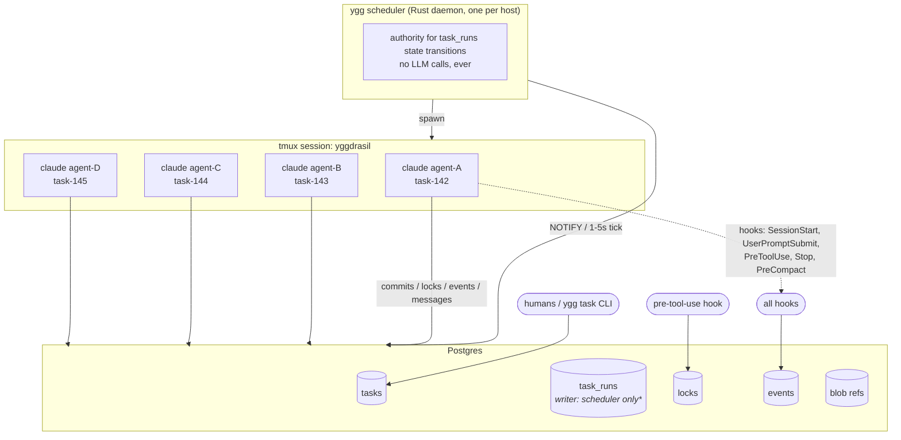
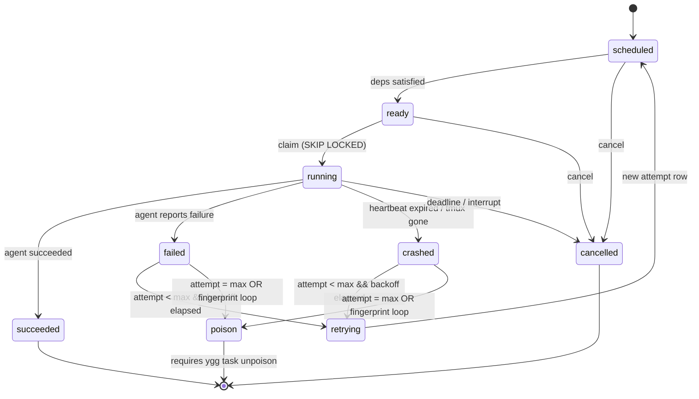

# Orchestration runtime

> How Yggdrasil autonomously advances a DAG of tasks. End-to-end view: from "task exists" to "code merged, downstream unblocked, next task started." Companion to [ADR 0016](adr/0016-autonomous-execution.md). See also: [Task-runs design](design/task-runs.md) · [Scheduler design](design/scheduler.md) · [Eval benchmarks](eval-benchmarks.md).

## The runtime in one paragraph

A single long-lived `ygg scheduler` daemon is the only writer of task-execution state. On a 1–5 second tick (and whenever Postgres NOTIFY fires a new-ready-work event) it claims ready tasks with `SELECT … FOR UPDATE SKIP LOCKED`, inserts a `task_runs` row per claim, calls the existing `ygg spawn` to launch a Claude Code agent in a tmux window, and records the binding. Spawned agents are passive — they run, produce output, touch files, commit, push, and stop. The existing `Stop` hook writes outcome data (commit SHAs, result summary, exit code) into the run row. The scheduler reads that data on its next tick, closes the run, releases locks, and advances downstream tasks. Retries, deadlines, and loop detection are the scheduler's responsibility; agents never retry themselves. The runtime has no LLM in its dispatch path — the expensive substrate does the work; the cheap substrate decides what work to do.

## The actors



Legacy ASCII rendering, for terminals without mermaid support:

```
┌────────────────────────────────────────────────────────────────┐
│ ygg scheduler (Rust daemon, one per host)                      │
│   authority for task_runs state transitions                    │
│   no LLM calls, ever                                           │
└──────────────┬─────────────────────────────────────────────────┘
               │ NOTIFY wake-up OR 1–5s tick
               │
               ▼
        ┌──────────────┐
        │   Postgres   │
        │   tasks      │◄──── writers: ygg task CLI, humans
        │   task_runs  │◄──── writer: scheduler only (*)
        │   locks      │◄──── writers: pre-tool-use hook, CLI
        │   events     │◄──── writers: everyone; audit log
        │   blobs ref  │
        └──────┬───────┘
               │ spawn
               ▼
┌────────────────────────────────────────────────────────────────┐
│ tmux session "yggdrasil" — one window per spawned agent        │
│                                                                │
│  ┌──────────┐  ┌──────────┐  ┌──────────┐  ┌──────────┐       │
│  │ claude   │  │ claude   │  │ claude   │  │ claude   │       │
│  │ agent-A  │  │ agent-B  │  │ agent-C  │  │ agent-D  │       │
│  │ task-142 │  │ task-143 │  │ task-144 │  │ task-145 │       │
│  └──────────┘  └──────────┘  └──────────┘  └──────────┘       │
│        │             │             │             │             │
│        │ hooks: SessionStart, UserPromptSubmit,  │             │
│        │ PreToolUse, Stop, PreCompact            │             │
└────────┼─────────────┼─────────────┼─────────────┼─────────────┘
         │             │             │             │
         ▼             ▼             ▼             ▼
    write commits / PRs / lock acquires / events / messages
```

(*) `Stop` hook writes outcome fields on the run row; the scheduler treats those as input and is the only one that advances `state` past `running`.

## The nine states of a task run



The legacy ASCII rendering follows for terminals without mermaid support:

```
       ┌───────────┐   scheduler picks              ┌───────────┐
       │ scheduled │──── deps satisfied ──────────► │   ready   │
       └─────┬─────┘                                └─────┬─────┘
             │ cancel                                     │ claim (SKIP LOCKED)
             ▼                                            ▼
       ┌───────────┐                                ┌───────────┐
       │ cancelled │                          ┌────│  running  │─────┐
       └───────────┘                          │    └───────────┘     │
                                       heartbeat                  agent
                                      expired: crashed            succeeds
                                              │                      │
                                              ▼                      ▼
                                        ┌───────────┐         ┌───────────┐
                                        │  crashed  │         │ succeeded │
                                        └─────┬─────┘         └───────────┘
                                              │
                                    agent reports failure
                                              │
                                              ▼
                                        ┌───────────┐
                                        │  failed   │
                                        └─────┬─────┘
                                              │ attempt < max_attempts
                                              ▼
                                        ┌───────────┐
                                        │ retrying  │──── new run row: scheduled
                                        └───────────┘
                                              │ attempt = max_attempts
                                              ▼
                                        ┌───────────┐
                                        │  poison   │────► human escalation
                                        └───────────┘
```

- **scheduled** — row written; deps may or may not be satisfied.
- **ready** — deps satisfied, no lock conflicts, eligible for claim.
- **running** — an agent has been spawned and is live. Heartbeat expected.
- **succeeded** — terminal. Output captured; downstream may advance.
- **failed** — terminal. Agent reported semantic failure (tests didn't pass).
- **crashed** — terminal. Infra-level failure (heartbeat expired, tmux gone).
- **cancelled** — terminal. User interrupted.
- **retrying** — transient. Bridges a failed/crashed run to a new scheduled run. Exists only so `ygg task show` can display the transition.
- **poison** — terminal. Exhausted `max_attempts`. Requires `ygg task unpoison` to retry.

`failed` and `crashed` are separate because their retry policies differ. `failed` often means "the agent did wrong work — try again with the failure as context." `crashed` means "the infra died — try again as if nothing happened."

## The tick loop

Pseudocode. Real implementation in [`src/scheduler.rs`](../src/scheduler.rs) (future).

```rust
loop {
    select! {
        // Zero-latency wake-up on new ready work or finished attempts.
        notification = listen("task_events") => tick(),

        // Safety net — LISTEN/NOTIFY can drop messages.
        _ = sleep(tick_interval) => tick(),
    }
}

fn tick() -> Result<()> {
    let budget = concurrency_budget();  // max_concurrent_agents − live attempts

    // (1) Reconcile: terminal runs whose outcome has been written but state not advanced.
    for run in runs_awaiting_finalize() {
        capture_outcome(run)?;   // read hook-written fields, compute state
        close_run(run)?;         // release locks, NOTIFY task_events
    }

    // (2) Reap: heartbeat-expired running attempts.
    for run in runs_heartbeat_expired() {
        force_state(run, State::Crashed, Reason::HeartbeatTimeout)?;
        close_run(run)?;
    }

    // (3) Retry: failed/crashed runs whose backoff has elapsed.
    for run in runs_retrying_due() {
        if run.attempt < run.max_attempts {
            insert_retry(run)?;   // new scheduled run with attempt+1, parent_run_id = run.id
        } else {
            poison(run)?;          // task.status = blocked, reason = poison
        }
    }

    // (4) Deadlines: running attempts past their deadline.
    for run in runs_past_deadline() {
        force_cancel(run, Reason::Timeout)?;
    }

    // (5) Dispatch: claim ready runs up to budget.
    let claimed = claim_ready(budget)?;  // SELECT … FOR UPDATE SKIP LOCKED
    for run in claimed {
        if requires_approval(run) && !approved(run) {
            continue;  // held until human approves; remains 'ready'
        }

        if fingerprint_looped(run) {
            poison(run, Reason::LoopDetected)?;
            continue;
        }

        spawn(run)?;  // calls existing ygg spawn; binds agent, worker, session
        transition(run, State::Running)?;
    }

    Ok(())
}
```

The body is ~200–300 lines of real Rust. Everything it does is already expressible against the existing `tasks`, `locks`, `agents`, `workers`, `events` tables plus the new `task_runs` table proposed in [design/task-runs.md](design/task-runs.md). No new infrastructure.

## Payload flow: how task A's output becomes task B's input

```
 task-A  ────────────────────────────────────────────────────────────►
   │                                                                │
 spawned, agent edits files, commits def456, pushes branch          │
   │                                                                │
   └─► Stop hook writes:                                             │
         task_runs[A].output.commits[0].sha = "def456…"              │
         task_runs[A].output.summary = "..."                         │
         task_runs[A].output_commit_sha = "def456…"                  │
                                                                    │
 scheduler reconciles: task_runs[A].state = succeeded               │
                       tasks[A].status    = closed                  │
                       NOTIFY task_events                           │
                                                                    │
 scheduler tick sees task-B unblocked (its only dep was A)          │
   │                                                                │
 before spawn(B), populate_inputs:                                  │
     task_runs[B].input.upstream = [                                │
         { task_ref: "A", run_id: …, commit_sha: "def456…",         │
           summary: "...", output: task_runs[A].output }            │
     ]                                                              │
                                                                    │
 SessionStart hook for B's spawned agent prints:                    │
     "Upstream task A (succeeded) produced commit def456…           │
      Summary: ... . Relevant outputs: { ... }"                     │
                                                                    │
 task-B agent consumes upstream inputs, does its work, commits      │
 bcd789, pushes branch, stops.                                      │
                                                                    ▼
 task_runs[B].output.commits = [{ sha: "bcd789…" }]
```

The upstream result is injected into B's context at session start, not at every turn. The injection is a one-shot premise ("here's what your upstream produced"), not an ongoing memory stream.

For code-producing tasks, the upstream reference is usually just a commit SHA. The receiving agent can `git show def456` on demand — the 40-byte pointer is all the orchestrator needs to pass. Large outputs that aren't code (test logs, analysis documents) go to the content-addressed blob store at `.ygg/blobs/<sha256>` and are referenced the same way.

## Lock integration: at-most-one-active-attempt

Locks remain unchanged. They enforce the **at-most-one-concurrent-agent** invariant on shared resources (file paths, branches, config keys). The scheduler's invariant on task runs is a separate, stronger statement: **at-most-one-active-attempt per task.**

These compose naturally:

1. Scheduler picks ready task T.
2. Before spawning, scheduler optionally acquires locks declared by T's input spec (e.g., `required_locks: ["src/db.rs"]`).
3. If any required lock is held, the scheduler leaves T in `ready` (not `running`) and tries again next tick. No spin — the NOTIFY wake-up includes `lock_released` events.
4. If all locks acquired, scheduler spawns the agent and the agent inherits the locks under the same `agent_id`. Per-tool locks (via the PreToolUse hook) continue to work for any files the agent touches that weren't pre-declared.

A task that crashes with locks held: the Stop hook's existing `release_all_for_agent` drops the locks as part of session cleanup. The scheduler's retry writes a new run with a new agent, which re-acquires from scratch.

## Human-in-the-loop: three levels

Per-task metadata sets the approval level. Default is `auto`.

```
auto:                  ready ─► running (immediate)

approve_plan:          ready ─► running (in Plan Mode)
                                   │
                                 agent writes plan to task_runs.plan
                                   │
                                 state holds at 'running' until
                                 tasks.approved_at IS NOT NULL
                                   │
                                 human: ygg task approve <ref>
                                   │
                                 agent exits Plan Mode, does work

approve_completion:    ready ─► running ─► agent finishes, stops
                                   │
                                 Stop hook does NOT close task; state
                                 transitions to 'awaiting_review'
                                   │
                                 human: ygg task close <ref>
                                   │
                                 state → succeeded; downstream advances
```

All three map to existing Claude Code primitives (Plan Mode = `--permission-mode plan`; approval gates = human action on task row). No separate approval UX. Dashboard shows tasks in `awaiting_approval` or `awaiting_review` as a distinct column.

Emergency override: `YGG_AUTO_APPROVE=1` in the scheduler's env bypasses `approve_plan`. Logged prominently to the events table with elevated severity so post-hoc audit is trivial.

## Dynamic child-spawn: `awaiting_children`

An agent mid-run may discover subtasks it didn't anticipate (Hatchet pattern). It runs `ygg task create --parent $YGG_TASK_ID ...` to emit children. The children start in `scheduled` state like any other task.

When the parent's own work is done:

```
parent_run.state   = succeeded
parent_task.status = awaiting_children    (not 'closed')
```

The scheduler on subsequent ticks checks:

```sql
SELECT task_id FROM tasks
WHERE status = 'awaiting_children'
  AND NOT EXISTS (
      SELECT 1 FROM tasks c
      WHERE c.parent_task_id = tasks.task_id
        AND c.status NOT IN ('closed','cancelled')
  );
```

Those tasks transition to `closed`. Downstream of the *epic* unblocks — never downstream of the parent-with-children-not-done.

Epic-level completion is the same predicate scoped to `epic_id`: an epic is complete when every task belonging to it (transitively, including tasks emitted during execution) is in a terminal state. No global "Yggdrasil is done" signal — this is a cross-repo coordinator, there is always potentially more work.

## Failure & retry semantics in practice

```
Scenario: task-142 fails on attempt 1, retries, succeeds on attempt 2.

 t0  scheduler claims task-142  → task_runs(task=142, attempt=1, state=scheduled)
 t0  scheduler spawns agent     → state=running, agent=a-7, worker=w-3
 t0+30m agent reports "cargo test failed: 2 tests red"
         Stop hook writes:
           task_runs(attempt=1).output = {failure: {...}, partial_commits: [aaa111]}
           task_runs(attempt=1).error  = {reason: agent_error, hint: "test file X"}
 t0+30m01s scheduler tick: reconciles
           task_runs(attempt=1).state = failed
           tasks(142).current_attempt_id = null
           (backoff timer starts, 60s exp for attempt 1)

 t0+31m scheduler tick: backoff elapsed, retry due
         insert task_runs(task=142, attempt=2, parent_run_id=<attempt1 row>,
                          state=scheduled, input={
                             ...base input...,
                             previous_attempt: { run_id, state: failed,
                                                 error: ...,
                                                 hint: "test file X",
                                                 partial_commits: [aaa111] }
                          })
         next tick picks up the scheduled row, dispatches attempt=2

 t0+55m agent produces a working fix, commits bcd789, tests pass.
         Stop hook writes task_runs(attempt=2).output = { commit: "bcd789" }
 t0+55m01s scheduler: task_runs(2).state = succeeded
                      tasks(142).status = closed
                      tasks(142).result_blob_ref = <commit 'bcd789'>
                      NOTIFY task_events
                      downstream tasks become 'ready'
```

The retried attempt sees `previous_attempt` in its input. The agent can use it as context ("attempt 1 produced aaa111 which was wrong because X; don't do that again"). The orchestrator doesn't know how to fix the problem; it just hands the prior failure forward.

## What the dashboard shows

The existing TUI grows two views and augments a third.

- **Tasks** pane (extant): add columns for `attempt`, `state`, `age-of-current-run`.
- **Runs** pane (new): list of recent runs across all tasks, filterable by state/agent/repo. `Enter` = show run detail with input/output/error payloads. `r` = requeue. `x` = cancel.
- **Dashboard** (extant): "Scheduler" tile — tick timestamp, wake reason (NOTIFY vs timer), queue depth (scheduled/ready counts), live attempts, budget used/remaining, last action ("spawned task-142 on agent-7"). A quiet scheduler is a healthy scheduler.

Humans operating Yggdrasil read the Runs pane the way they currently read `ygg status` — it's the "what's happening right now" surface.

## What the hooks do

All five existing hooks keep their existing responsibilities. New responsibilities are additive.

| Hook | Existing | New |
|---|---|---|
| **SessionStart** | `ygg prime` emits context | If spawned from scheduler, prime includes `task_runs.input.upstream` and plan-mode flag if any |
| **UserPromptSubmit** | `ygg inject`, drain inbox | Drain per-task messages (extension of existing inbox) |
| **PreToolUse** | Auto-acquire lock on Edit/Write | `task_runs.heartbeat_at = now()` bumped on every tool call |
| **Stop** | Release all locks, `ygg digest`, `ygg stop-check` | Write outcome into `task_runs` row so scheduler can finalize |
| **PreCompact** | `ygg digest` + `ygg prime` | Unchanged |

`Stop`'s new responsibility is important: it is the *only* place that writes completion data. The scheduler is the *only* place that reads it and advances state. This two-stage handoff (hook writes raw outcome → scheduler computes state) keeps the scheduler deterministic and gives it one consumer of hook data, not many.

## Observability

The event stream already captures everything. Adding four new event kinds lets a `ygg logs --follow` session watch the scheduler live:

- `run_scheduled` — new run row inserted
- `run_claimed` — scheduler picked a ready run
- `run_terminal` — run moved to a terminal state, with payload `{state, reason}`
- `scheduler_tick` — periodic heartbeat (suppressed by default; enabled with `--verbose`)

Combined with the existing `lock_acquired`, `lock_released`, `task_status_changed`, `agent_state_changed`, `message` events, the stream reconstructs every interesting moment of a DAG execution without the scheduler carrying its own logging.

## Testing strategy

Two layers:

1. **Unit tests** around the scheduler's tick loop, using a test Postgres. Fast, deterministic, cover state-machine transitions, SKIP LOCKED semantics, retry math, backoff, deadline enforcement, poison detection, loop fingerprint.
2. **Integration tests** that run real `claude -p` agents against fixture tasks. Slow, costs money, run in CI on main only. These become the Tier-A `ygg bench` smoke test — `independent-parallel-n` with N=2 fits in <3 minutes.

The eval suite (`ygg bench`, [docs/eval-benchmarks.md](eval-benchmarks.md)) is the long-running validation layer: does the scheduler actually make multi-agent coding faster and more reliable than vanilla Claude Code?

## What this is not

- Not a workflow DSL. Workflows are task rows with deps. If you want to express a workflow, write tasks.
- Not a job queue for generic compute. It orchestrates `claude` invocations specifically — the spawn primitive is `ygg spawn`, not a generic `ygg exec`.
- Not a BDD framework. Tests-pass is one kind of acceptance; others (PR merged, diff smaller than N, LLM-judge rubric) are valid and agent-defined.
- Not an SLA enforcer for production workloads. It runs in a developer's tmux session. The deadlines it enforces are conveniences, not contracts.
- Not a replacement for human judgement on high-stakes changes. The approval levels exist precisely so that stakes-sensitive work keeps a human in the loop.
