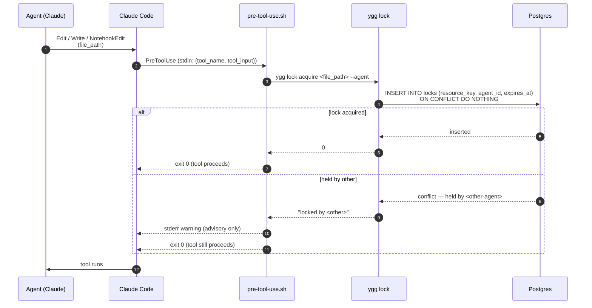
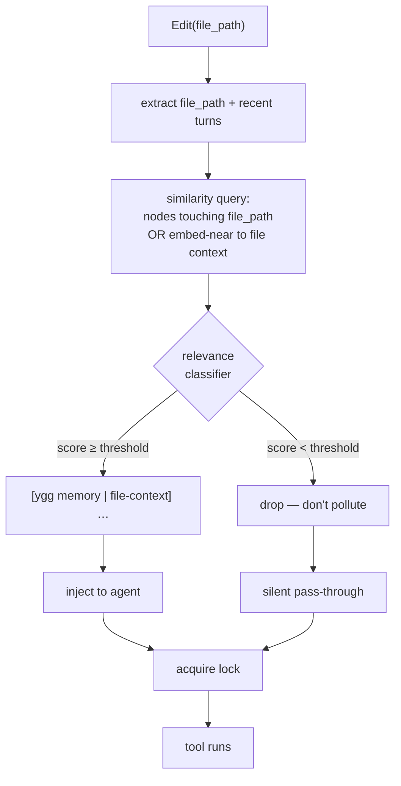

# Retrieval and injection

> How Yggdrasil surfaces prior-conversation context to the active agent.

See also: [Design principles](design-principles.md) · [Open questions](open-questions.md) · [ADR 0001](adr/0001-postgres-pgvector-single-store.md) · [ADR 0002](adr/0002-local-ollama-embeddings.md) · [ADR 0003](adr/0003-lock-graph-coordination.md) · [ADR 0005](adr/0005-shell-hook-integration.md)

## Why embeddings (and why not only embeddings)

The question agents actually need answered is usually not *"does any past turn literally contain this string?"* but *"has this topic, this problem, this class of mistake come up before, even phrased differently?"* The first question keyword search answers well; the second it can't.

Examples that a keyword index misses but an embedding index catches:

- The user once corrected "stop using `Arc<Mutex>` — use channels." Six weeks later a different agent in a different repo is about to write `Arc<Mutex<Vec<T>>>`. The literal words don't match; the semantics do.
- A prior session concluded with "migrations must be backwards-compatible because we run blue-green deploys." A new migration draft doesn't mention blue-green at all, but it should still surface that constraint.
- An earlier `tool_result` contained the exact cargo error message an agent is about to produce again.

That said, Yggdrasil runs on Postgres, and Postgres gives us **both** modes for free: `pgvector` for dense semantic similarity, and native `tsvector` + `ILIKE` + trigram indexes for lexical match. They're not alternatives, they compose. The current `ygg inject` pipeline only uses embeddings, but hybrid retrieval — run both, union the candidate set, re-rank — is a well-known pattern that often beats either alone. It's a strict addition rather than a replacement: a file-path literal match and a semantic neighbor are both valid evidence, and Postgres can score them in the same query.

Hybrid retrieval is on the roadmap, not shipped. When we do add it, it slots in *before* the classifier in [Open questions](open-questions.md) — first broaden recall, then tighten precision.

Dense vector retrieval is what ships today. The trick is that **both the stored node and the incoming query land in the same 384-dimensional space**, where "closeness" is semantic, not lexical:

```mermaid
flowchart LR
    subgraph PAST["Past turns (in DB)"]
        P1["'don't use Arc&lt;Mutex&gt;, use channels'"]
        P2["'migrations must be backwards-compat'"]
    end
    subgraph NOW["Incoming prompt"]
        N1["'wrap this Vec in Arc&lt;Mutex&gt;'"]
    end
    subgraph EMB["Ollama embed"]
        E[("all-MiniLM-L6-v2<br/>384-dim")]
    end
    subgraph VEC["Vector space"]
        direction LR
        V1["&#x2022;"] -.near.- VN["&#x25CF;"]
        V2["&#x2022;"]
    end
    P1 --> E
    P2 --> E
    N1 --> E
    E --> V1
    E --> V2
    E --> VN
    VN -.cosine&nbsp;distance.-> V1
    VN -.cosine&nbsp;distance.-> V2
```



Yggdrasil uses [pgvector](https://github.com/pgvector/pgvector) with HNSW indexes (see [ADR 0001](adr/0001-postgres-pgvector-single-store.md)) and local Ollama embeddings (see [ADR 0002](adr/0002-local-ollama-embeddings.md)). HNSW scales sub-linearly with corpus size; at our current parameters (`m=16, ef_construction=64`) on the node volume a single user's sessions produce, queries complete fast enough to run on every user prompt without the human noticing. Concrete recall and latency numbers are open benchmarks we haven't published; the paper's published curves suggest reasonable recall at these settings, but we aren't going to claim a specific percentage until we measure.

## Why inject automatically, not on demand

An alternative to auto-injection is an agent-invoked tool: expose `ygg_recall(query)` via MCP and let the model decide when to use it. We rejected this (see [ADR 0005](adr/0005-shell-hook-integration.md)) because models are bad at knowing what they don't know. The memory they *need* is often the memory they've forgotten exists — asking them to voluntarily reach for it produces underuse. Auto-injection on every prompt puts the question where the model can't miss it: *"here are the most-similar things anyone has ever said about what you just asked. Use them or ignore them, but you've seen them."*

Cost matters too. Pre-injecting at the hook level means one similarity query per user turn — deterministic, and on a local Postgres instance with a small corpus typically well under a second. A tool-invoked design would incur round-trips at whatever frequency the model decides, which is both less predictable and typically less efficient.

## What gets injected, and when

Yggdrasil currently injects context at two points in the Claude Code lifecycle:

**UserPromptSubmit (`ygg inject`)** — runs before every user turn reaches the model:

1. Embeds the user's prompt via Ollama.
2. Writes it as a `user_message` node in the DAG with its embedding.
3. Runs a global similarity search across **every agent's** `user_message`, `directive`, and `digest` nodes.
4. Filters to hits with cosine distance ≤ 0.6 (≈ similarity ≥ 0.4), up to 8 results.
5. Emits each as a `[ygg memory | <agent> | <age> | sim=<n>%] <snippet>` line.
6. Appends any locks the current agent holds, plus a context-pressure warning if >75%.

The result is the blob you see at the top of each user turn — a compact summary of "what the rest of the system already knows that might be relevant here." Implementation: `src/cli/inject.rs`.

```mermaid
sequenceDiagram
    autonumber
    participant U as User
    participant CC as Claude Code
    participant H as prompt-submit.sh
    participant I as ygg inject
    participant O as Ollama
    participant PG as Postgres + pgvector

    U->>CC: types prompt
    CC->>H: UserPromptSubmit<br/>(stdin: {prompt, ...})
    H->>I: ygg inject --agent --prompt
    I->>O: embed(prompt)
    O-->>I: 384-dim vector
    I->>PG: INSERT node (kind=user_message, embedding)
    I->>PG: SELECT top-k WHERE distance &lt; 0.6<br/>AND kind IN (user_message, directive, digest)
    PG-->>I: hits across all agents
    I-->>H: stdout: [ygg memory | ...] lines
    H-->>CC: injected as system context
    CC->>U: assistant turn begins<br/>with memory lines visible
```

**PreToolUse (`ygg lock acquire`)** — runs before every `Edit`, `Write`, or `NotebookEdit`:

1. Extracts the target file path from the tool's input.
2. Auto-acquires a lock keyed on that path.
3. If another agent holds the lock, emits a warning to stderr (advisory, not blocking).

This is coordination, not retrieval — the model doesn't see new context at this step, it just ensures two agents don't collide on the same file. Implementation: `src/lock.rs`, [ADR 0003](adr/0003-lock-graph-coordination.md).



## What we don't yet inject at the tool level — and why it's interesting

Today the PreToolUse hook is purely mechanical (lock acquire). There's an obvious next frontier: when an agent is about to edit `src/db.rs`, surface prior corrections, prior bugs, prior approaches involving that file — automatically, without the agent having to remember to ask. The prototype of that looks like:

- Extract the target path from the tool input.
- Query for nodes that either mention the path, are ancestors of edits to the path, or are embeddings-similar to the path + recent conversational context.
- Inject a `[ygg memory | file-context] …` block.

We haven't shipped this yet because it tightens the feedback loop between "noisy retrieval" and "agent behavior" — a bad file-level hit during a tool call is more disruptive than the same hit during a user turn. This is where the classifier idea in [Open questions](open-questions.md) becomes load-bearing: per-tool injection is exactly where precision matters most. It's on the roadmap once we trust our relevance scoring.

Sketch of the proposed tool-level injection flow:



The classifier is the new piece — trained on whether prior injected hits were *referenced* by the agent in its next turn, collecting labels passively from live traffic. See [Open questions](open-questions.md) for the research angle.
